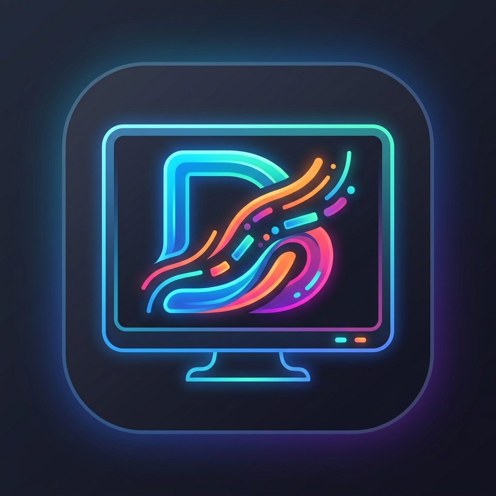
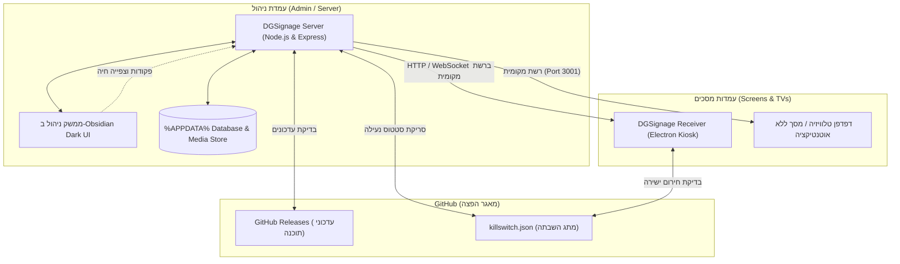

<div align="center">



# 📺 DGSignage — מרכז ההפצה וההורדות הרשמי
### Official Distribution & Release Repository for DGSignage Platform

[](https://github.com/Hero-Ghost/dgsignage-releases/releases/tag/v2.5.0)
[](https://github.com/Hero-Ghost/dgsignage-releases/releases/tag/v2.5.0)
[](killswitch.json)
[]()

<p align="center">
  <b>ברוכים הבאים למאגר ההפצה הראשי של DGSignage.</b><br/>
  כאן מפורסמים כל קובצי ההתקנה הרשמיים, גרסאות ה-Portable, עדכוני המערכת האוטומטיים והגדרות מתג ההשבתה מרחוק (Kill Switch).
</p>

---

[📥 הורדות ישירות](#-מדריך-הורדות-מה-מורידים-ומה-לא-להוריד) •
[🛑 מתג השבתה מרחוק (Kill Switch)](#-מתג-השבתה-מרחוק-kill-switch) •
[✨ תכונות ויכולות](#-יכולות-ופיצרים-מרכזיים) •
[🏗️ ארכיטקטורה](#️-ארכיטקטורת-המערכת) •
[🚀 מדריך התקנה מהיר](#-מדריך-התקנה-ושימוש)

---

</div>

## 📥 מדריך הורדות: מה מורידים ומה לא להוריד!

> [!IMPORTANT]
> **הנחיה למנהלי רשת ומשתמשים:** המערכת פועלת במודל שרת-לקוח. יש להוריד אך ורק את הקובץ המתאים לכל עמדה.

```
                  ┌─────────────────────────────────────────┐
                  │          איזה מחשב אתם מגדירים?         │
                  └────────────────────┬────────────────────┘
                                       │
            ┌──────────────────────────┴──────────────────────────┐
            ▼                                                     ▼
┌───────────────────────┐                             ┌───────────────────────┐
│  מחשב מנהל / משרדי    │                             │ מחשב טלוויזיה / מסך   │
│   (Server & Admin)    │                             │  (Screen Receiver)    │
└───────────┬───────────┘                             └───────────┬───────────┘
            │                                                     │
            ▼                                                     ▼
   הורידו את תוכנת                                       הורידו את תוכנת
  "שרת וניהול" (Server)                                 "רסיבר מסכים" (Receiver)
```

### 1. קובצי הורדה למחשב המנהל (Server & Admin)
קובץ זה מיועד **אך ורק למחשב המרכזי** שממנו מנהלים את המערכת, מעלים תמונות ווידאו, ועורכים פלייליסטים.

* 📦 **[הורדת DGSignage Setup (שרת וניהול) - גרסה 2.5.0 (161MB)](https://github.com/Hero-Ghost/dgsignage-releases/releases/download/v2.5.0/DGSignage-Setup-2.5.0.exe)**  
  *(מומלץ)* קובץ התקנה מלא עבור Windows x64. יוצר קיצור דרך, מתקין שירות מערכת, עולה עם הפעלת המחשב ותומך בשדרוג ישיר.
* 💼 **[הורדת DGSignage Portable (שרת נייד) - גרסה 2.5.0 (160MB)](https://github.com/Hero-Ghost/dgsignage-releases/releases/download/v2.5.0/DGSignage-Portable.exe)**  
  גרסה ניידת ללא צורך בהתקנה. מתאימה לבדיקות או להרצה מ-Disk On Key.

---

### 2. קובצי הורדה למחשבי המסכים והטלוויזיות (Receiver)
קובץ זה מיועד **אך ורק למחשבים המחוברים ישירות למסכים** (Mini PC / Intel NUC / Windows TV Stick).

* 📺 **[הורדת DGSignage Receiver Setup (רסיבר למסך) (102MB)](https://github.com/Hero-Ghost/dgsignage-releases/releases/download/v2.5.0/DGSignageReceiver-Setup.exe)**  
  *(מומלץ לכל מסך)* נגן קל משקל הננעל למסך מלא (Kiosk Mode), מונע מצב שינה ב-Windows, ועולה אוטומטית בהדלקת המחשב.
* 🚀 **[הורדת DGSignageReceiver Portable (רסיבר נייד) (101MB)](https://github.com/Hero-Ghost/dgsignage-releases/releases/download/v2.5.0/DGSignageReceiver-Portable.exe)**  
  גרסת רסיבר ניידת הניתנת להפעלה מיידית בלחיצה כפולה ללא התקנה.

---

### 📋 טבלת השוואה: מי מוריד מה?

| סוג העמדה / המחשב | הקובץ שעליך להוריד | מה **אסור** להוריד לשם! | תפקיד התוכנה |
| :--- | :--- | :--- | :--- |
| **מחשב מנהל / מזכירות / שרת** | `DGSignage-Setup-2.5.0.exe` | ❌ לא להוריד את ה-Receiver | מנהל את כל הפלייליסטים, המדיה, המסכים וההגדרות. |
| **מחשב מחובר למסך / טלוויזיה** | `DGSignageReceiver-Setup.exe` | ❌ לא להתקין את השרת (Server) | מתחבר לשרת הניהול ברשת המקומית ומציג את התוכן ברצף. |
| **מסך ללא מחשב (Smart TV)** | אין צורך בהורדה | ❌ אין צורך בשום קובץ EXE | פותחים את הדפדפן בטלוויזיה לכתובת המסך הלא-מאומת. |
| **בדיקה מהירה / ללא הרשאות** | קובצי ה-`Portable.exe` | - | הפעלה ישירה של השרת או הרסיבר ללא צורך במתקין. |

---

## 🛑 מתג השבתה מרחוק (Remote Kill Switch)

מאגר זה מארח את קובץ השליטה וההשבתה [`killswitch.json`](killswitch.json).  
כל המערכות המותקנות אצל הלקוחות (שרתים ורסיברים) בודקות קובץ זה באופן קבוע ברקע.

### כיצד להשבית / לנעול את המערכת מרחוק:
1. היכנסו לקובץ [`killswitch.json`](killswitch.json) במאגר זה.
2. לחצו על כפתור העריכה (סמל העיפרון ✏️).
3. שנו את הערך מ-`false` ל-`true`:
```json
{
  "killSwitchActive": true,
  "reason": "המערכת הושבתה על ידי מנהל המערכת. לפרטים נא לפנות לתמיכה.",
  "action": "lock",
  "updatedAt": "2026-09-26T00:00:00Z"
}
```
4. לחצו **Commit changes**.
5. **מה קורה מיד אצל כל הלקוחות?**
   - שרתי ה-API נחסמים מיד ומחזירים שגיאת נעילה (`HTTP 423 Locked`).
   - מסכי הניהול, נגני התצוגה ומסכי הרסיבר עוברים למסך נעילה אדום וחוסם (Red Lock Screen).
   - נוצר קובץ נעילה מקומי (`.system_lock`) – גם אם הלקוח ינתק את כבל הרשת או יאתחל את המחשב, התוכנה תישאר נעולה לחלוטין!

### כיצד להחזיר את המערכת לפעולה רגילה?
החזירו את הערך בקובץ ל-`"killSwitchActive": false` ושמרו. המערכות יזהו את הביטול, יסירו את הנעילה המקומית ויחזרו לפעולה אוטומטית מלאה.

---

## ✨ יכולות ופיצ'רים מרכזיים

* 🚨 **התרעות פיקוד העורף בזמן אמת:** זיהוי חי של אזעקות אמת וסירנות לפי יישוב נבחר בכל פלייליסט, השתלטות אוטומטית חזותית וקולית על כל המסכים ומודאל סימולציה מובנה.
* 📰 **טיקר מבזקי חדשות ישראליים:** צ'יפים מובנים ל-Ynet, וואלה, N12 וכאן 11, תמיכה ב-RSS מותאם אישית וטקסט רץ חופשי.
* 🎨 **עורך פריסות מסך רב-אזורי (Multi-Zone):** פריסת מסך מלא, מסך מפוצל (50/50), סרגל צד ורשת 4 אזורים (2x2).
* 👥 **ניהול קבוצות מסכים חכם (קבוצות A עד F):** שיוך פלייליסטים ופריסות לעשרות מסכים בלחיצה אחת.
* 📸 **צילום מסך חי מרחוק (Remote Live Screenshot):** צפייה בזמן אמת במה שמוצג על כל מסך ומסך ברשת.
* 🖼️ **ספריית מדיה עשירה:** תמונות, סרטוני וידאו, טקסט מעוצב WYSIWYG, שעון אנלוגי/דיגיטלי, תאריך עברי ומזג אוויר מקומי.
* 🔌 **עמידות מלאה לאופליין:** המערכת פועלת 100% מקומית ברשת ה-LAN ללא תלות בענן חיצוני.
* 🔄 **שדרוג ישיר וחלק (In-Place Upgrade):** שדרוג תוכנה השומר על 100% מהפלייליסטים, המדיה וההגדרות ב-`%APPDATA%`.

---

## 🏗️ ארכיטקטורת המערכת



---

## 🚀 מדריך התקנה ושימוש

### 1. התקנת השרת במחשב הראשי
1. הורידו והפעילו את **[DGSignage-Setup-2.5.0.exe](https://github.com/Hero-Ghost/dgsignage-releases/releases/download/v2.5.0/DGSignage-Setup-2.5.0.exe)**.
2. השרת וממשק הניהול ייפתחו אוטומטית בדפדפן בכתובת `http://localhost:3001`.
3. קבעו סיסמת מנהל ראשונית.

### 2. יצירת תוכן ופלייליסטים
1. בלשונית **פלייליסטים**, צרו פלייליסט חדש והוסיפו שקופיות מדיה.
2. הפעילו את טיקר המבזקים או התרעות פיקוד העורף לפי הצורך.

### 3. חיבור המסכים
1. בכל מחשב מסך, התקינו את **[DGSignageReceiver-Setup.exe](https://github.com/Hero-Ghost/dgsignage-releases/releases/download/v2.5.0/DGSignageReceiver-Setup.exe)**.
2. הרסיבר יציג קוד צימוד בן 6 ספרות.
3. בממשק הניהול, היכנסו ללשונית **מסכים** -> **צמד מסך חדש** והזינו את הקוד.

---

<div align="center">
  <sub>DGSignage Platform • מרכז הפצה ועדכונים רשמי</sub>
</div>
